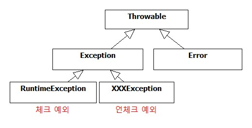

# 예외
## 목차
1. 예외의 종류와 특징
1. 예외처리 방법
	1. 예외 복구
	1. 예외 회피
	1. 예외 전환
1. 예외처리 전략
	1. 낙관적 예외처리 기법과 비관적 예외처리 기법
	1. 애플리케이션 예외
1. 스프링의 예외처리 전략
	1. JDBC의 문제점과 해결 전략
	1. 데이터 엑세스 기술에 대한 독립
	
---

### 예외의 종류와 특징

#### Error
 **시스템에 비정상적인 상황이 발생**했을 경우에 사용된다. 주로 VM에서 발생시키며 애플리케이션 코드에서 캐치해도 대응 방법이 없다. 시스템 레벨에서 특별한 작업을 하는게 아니라면 에러 처리는 신경쓰지 않아도 된다.

#### Exception
##### xxxException (체크 예외, checked exception)
 Exception의 서브 클래스 중 RuntimeException을 상속하지 않은 예외를 말한다. **체크 예외는 예외 처리를 컴파일 타임에 강제**한다. 
##### RuntimeException (언체크 예외, unchecked exception)
 RuntimeException를 상속한 모든 예외를 말한다. 주로 프로그램의 오류가 있을 때 발생하도록 의도된 것들이며, 예외 처리를 강제하지 않는다. 피할 수 있지만 **개발자의 부주의에 의해 발생하도록 만든 것이 런타임 예외**이다. 따라서 런타임 예외는 예상하지 못했던 예외상황에서 발생하는 게 아니기 때문에 **예외 처리를 강제하지 않도록 만든 것**이다.

> JDK 설계의도가 현실과 잘 맞지 않는다고 비난의 대상이 되기도 했다. 특히 체크 예외의 불필요성을 주장하는 사람들이 늘어갔다. 체크 예외가 예외처리를 강제하는 것 때문에 예외 블랙홀이나 무책임한 throws 코드가 남발됐다. 최근에 새로 등장하는 자바 표준 스펙의 API들은 예상 가능한 예외상황을 다루는 예외를 체크 예외로 만들지 않는 경향이 있기도 하다.
> 

---

### 예외처리 방법

#### 예외 복구
 **예외상황을 파악하고 문제를 해결해서 정상 상태로 돌려놓는 방법**이다. 비록 기능적으로는 사용자에게 예외상황으로 비쳐도 애플리케이션에서는 **정삭적으로 설계된 흐름에 따라 진행**되어야 한다. 예외처리를 강제하는 체크 예외들은 어떤식으로든 예외를 복구할 가능성이 있는 경우 사용한다.

#### 예외 회피
 **예외처리를 자신이 담당하지 않고 호출한 쪽으로 전달하는 방법**이다. 그러나 자신의 코드에서 발생한 예외를 그냥 던져버리는 건 무책임한 책임회피일 수 있다. 따라서 **예외를 회피하는 것은 의도가 분명**해야 한다. 템플릿/콜백처럼 긴밀한 관계에 있는 다른 오브젝트에게 예외처리 책임을 분명히 지게 하거나, 자신을 사용하는 쪽에서 예외를 다루는 게 최선의 방법이라는 분명한 확신이 있어야 한다. 

#### 예외 전환
 **발생한 예외를 적절한 예외로 전환하여 호출한 쪽으로 전달하는 방법**이다. 예외를 복구해서 정상 상태로 만들 수 없는 경우 **의미가 분명한 예외로 전환하여 호출한 쪽에서 처리하기 쉽도록** 만든다. 여기서 처리하기 쉽다는 것의 의미는 RuntimeException으로 전환하여 던지면 불필요한 try - catch문을 줄일 수 있으며 또는 로우레벨의 예외를 좀 더 의미있고 추상화된 예외로 전환하여 예외의 의미를 강화할 수 있다는 것이다. 보통 전환하는 예외에 원래의 예외를 담는 **중첩 예외**(nested exception)로 만드는 것이 좋다. 

---

### 예외처리 전략

 자바 엔터프라이즈 서버환경에서는 서버의 특정 계층에서 예외가 발생했을 때 작업을 일시 중지하고 사용자와 바로 커뮤니케이션하면서 예외상황을 복구할 수 있는 방법이 없다. 따라서 **애플리케이션 차원에서 예외상황을 미리 파악하고, 예외가 발생하지 않도록 차단**하는 게 좋다. 또는 프로그램의 오류나 외부 환경으로 인해 예외가 발생하는 경우라면 빨리 **해당 요청의 작업을 취소하고 서버 관리자나 개발자에게 통보**해주는 편이 낫다.

 자바의 환경이 서버로 이동하면서 체크 예외의 활용도와 가치는 점점 떨어지고 있다. 그래서 **대응이 불가능한 체크 예외라면 빨리 런타임 예외로 전환**해서 던지는 게 낫다. 최근 등장하는 JDK  스펙 또는 오픈소스 프레임워크에서는 API가 발생시키는 예외를 체크 예외 대신 언체크 예외로 정의하는 것이 일반화되고 있다. **예전에는 복구할 가능성이 조금이라도 있다면 체크 예외로 만든다고 생각했는데, 지금은 항사 복구할 수 있는 예외가 아니라면 일단 언체크 예외로 만드는 경향**이 있다. 

#### 낙관적인 예외처리 기법과 비관적인 예외처리 기법
 * **낙관적인 예외처리 기법**
    * Unchecked exception 기반의 예외처리
    *  복구할 수 있는 예외는 없다고 가정하고 예외가 생겨도 어차피 런타임 예외이므로 시스템 레벨에서 알아서 처리해줄 것이고, 꼭 필요한 경우는 런타임 예외라도 잡아서 복구하거나 대응해줄 수 있으니 문제될 것이 없다는 낙관적인 태도를 기반으로 하고있다. 
 * **비관적인 예외처리 기법**
    * Checked exception 기반의 예외처리
    * 직접 처리할 수 없는 예외가 대부분이라고 하더라도 혹시 놓치는 예외가 있을 수 있으니, 일단 잡고 보도록 강제한다는 비관적인 태도를 기반으로 하고있다.

#### 애플리케이션 예외

 시스템 또는 외부의 예외상황이 원인이 아니라 애플리케이션 자체의 로직에 의해 의도적으로 발생시키고, 반드시 catch 해서 조치를 취하도록 요구하는 예외를 애플리케이션 예외라고 한다.

* **리턴값을 통한 예외처리**
* 예외 상황에 대한 리턴값을 애플리케이션에서 정한 특별한 값으로 리턴하는 방법
  * 예외 코드 정책이 완벽하게 갖추어져 있어야한다.
  * 사용하는 쪽에서 리턴값을 확인하는 조건문이 자주 등장하여 코드가 지저분해진다.
  
* **Checked exception을 통한 예외처리**
* 예외 상황에 비즈니스적인 의미를 띤 예외를 던지는 방법
  * try - catch를 이용하여 if보다 상대적으로 깔끔한 코드를 유지할 수 있다.

---

### 스프링의 에외처리 전략
#### JDBC의 문제점과 해결 전략
 JDBC를 통해 개발자는 DB에 상관없이 표준화된 방법을 이용하여 프로그램을 개발할 수 있다. 그러나 JDBC만으로는 DB 종류에 완전히 독립된 프로그램을 개발하기 위해서는 몇 가지 문제점이 있다.

* **비표준 SQL**

  * 문제점
    * DB마다 특화된 비표준 SQL과 기능을 제공한다.
    * 이러한 비표준 SQL을 사용하면 DB의 자유로운 변경에 제약이 따른다.
    * 그러나 보통 DB의 변경보다는 현재 DB에 최적화하는 것이 중요하므로 비표준 SQL을 사용한다.
> 이 문제에 대한 해결은 나중에 다룬다.  

* **호환성 없는 SQLException의 DB 에러정보**
  * 문제점
    * 데이터 처리 중 발생하는 다양한 예외를 JDBC는 SQLException 하나에 담아버린다.
    * DB마다 에러 코드가 제각각이기 때문에 DB의 자유로운 변경에 제약이 따른다.
  * 스프링의 해결 전략 - DB 에러 코드 매핑을 통한 예외 전환
    * 스프링은 SQLException을 대체하는 DataAccessException이라는 런타임 예외를 정의하고 있으며 서브클래스로 세분화된 예외 클래스를 정의하고 있다. 그리고 스프링은 DB별 에러 코드를 분류해서 스프링이 정의한 예외클래스와 매핑하는 테이블을 만들어두고 이를 활용한다.

#### 데이터 엑세스 기술에 대한 독립
 자바에는 JDBC 외에도 다양한 데이터 엑세스 표준 기술이 존재한다. JDO나 JPA도 표준 퍼시스턴스 기술이지만 JDBC와 사용법이 크게 다르며 TopLink나 하이버네이트같은 독자적인 프로그래밍 모델을 지원하는 ORM 기술이 있다. 또한 JDBC와 비슷하지만 발생하는 예외가 다른 iBatis도 있다.
 이렇게 다양한 데이터 엑세스 기술로부터 DAO의 의존성을 제거하기 위해 스프링은 데이터 엑세스 기술에 대한 예외를 추상화하여 제공한다. 따라서 DAO가 데이터 엑세스 기술에 독립적으로 존재하기 위해서는 DAO 인터페이스와 구현체를 분리해야만 한다.
> 용어의 차이??
> 데이터 엑세스 기술, 퍼시스턴스 기술, ORM : 정확히 어떻게 다른가?? 

##### 주의사항
 스프링에서는 JDBC의 경우 DB의 에러코드를 바로 해석하여 DataAccessException 계층과 매핑하지만, JPA나 하이버네이트, JDO 등에서는 각 기술이 정의한 예외를 가져와 DataAccessException 계층으로 매핑한다. 그러나 각 기술이 정의한 예외가 DB의 에러코드보다 세분화되어 있지 않기 때문에 JDBC에 비해 포괄적인 예외로 매핑된다. 따라서 데이터 엑세스 기술을 변경했을 때 동일한 예외 매핑을 기대할 수 없으므로 사용에 주의를 기울여야한다.

> 궁금한것
> 대표적인 데이터 엑세스 기술은 뭐가 있고, 각각의 장단점은 무엇인가?
> 요즘은 어떤 기술을 많이 사용하는가?